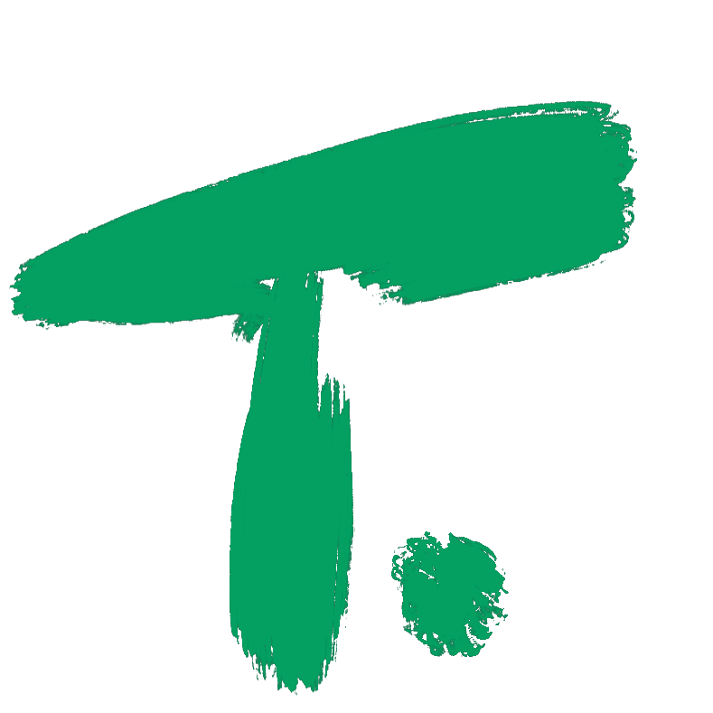

<div align="left">
  <h1>
    
  	SolInv/Venti
  </h1>
</div>

Solidity Contract Invariant Synthesis Using Deduction-Guided Reinforcement Learning.

<div align="left">
  This project is powered by  Trinity-Edge (based on an early snapshot).
</div>

## Requirements

- Trinity-Edge ([https://github.com/chyanju/Trinity-Edge](https://github.com/chyanju/Trinity-Edge))
  - Including all its dependency requirements:
    - sexpdata
- PyTorch ([https://pytorch.org/](https://pytorch.org/))
  - 1.8.0 recommended for compatability with PyG with GPU)
- PyTorch Geometric ([https://github.com/pyg-team/pytorch_geometric](https://github.com/pyg-team/pytorch_geometric))
- RLlib ([https://docs.ray.io/en/latest/rllib.html](https://docs.ray.io/en/latest/rllib.html))
- SolidTypes ([https://github.com/Technius/SolidTypes.git](https://github.com/Technius/SolidTypes.git))
  - `list-sto-vars` branch
  - Including all its dependency requirements:
    - solc-select
    - z3-solver
  - Note: Run `stack build` **<u>without</u>** `conda` environment enabled.
- python-igraph ([https://igraph.org/](https://igraph.org/))

SolInv/Venti inherits part of the [Trinity](https://github.com/fredfeng/Trinity) and [ReMorpheus](https://github.com/chyanju/ReMorpheus) frameworks, but you don't have to install them.

## Commands

```bash
# run without gpu
python ./example0.py

# run with gpu
CUDA_VISIBLE_DEVICES=0 python ./example0.py --ngpu 1

# tee
CUDA_VISIBLE_DEVICES=0 python ./example0.py --ngpu 1 2>&1 | tee -a ./log.txt

# start tensorboard, port is 6006
tensorboard --host 0.0.0.0 --logdir=~/ray_results
```

## Design Notes

#### Reward Design (Outdated)

```
# ================================ #
# ====== reward computation ====== #
# ================================ #
# hm: heuristic multiplier (default 1.0, any heuristic failing will make it 0.1)
# rm: repeat multiplier (default 1.0, computed by 1.0/<times>)
# all rewards will be multiplied by hm and rm
# there are different cases
# if the invariant is complete
#   - if it fails some heuristics: 1.0
#   - else
#     - if it fails the checking: 0.1
#     - if it passes the checking: 10.0 * percentage_of_constraints_passed 
# if the invariant is not complete
#   - but it reaches the max allowed step: 0.0 (which means it should've completed before)
#   - and it still can make more steps: 0.1 (continue then)
```

## Useful Resources

- https://docs.ray.io/en/latest/rllib-training.html#customizing-exploration-behavior
- https://docs.ray.io/en/latest/rllib-training.html#getting-started
- https://codepen.io/sosuke/pen/Pjoqqp
- https://docs.aws.amazon.com/dlami/latest/devguide/tutorial-base.html

## TODO's

- ✓ Cache the graph for every contract.
- ✓ Repeat multipliers should be using different denominators across contracts.
- ✓ Investigate into the memory overflow issue.
- ✓ Improve action masking to rule out redundant flex actions.
- ✓ Enable GPU support.
- ✓ Need more efficient network computation to speed up in GPU mode, the current computation is not efficient enough: profiling of which procedure takes longest (for-loop, graph comp., or other).
- ✓ Cache contract representation **<u>*within*</u>** one single `forward` call to speed up computation.
- ✓ Only invariants that pass all the constraints will have no repeat multiplier, but some contracts have ground truth invariants that do not pass all soft constraints.
  - ✓ Current reward can't tell apart sub-optimal invariants (those with all hard constarints satisfied but some soft constraints not satisfied).
  - ✓ Add baseline scoring system to avoid proposing stupid invariant.
- ▢ Switch to a more precise DSL.
- ▢ Check and set a proper `max_step` in training.

